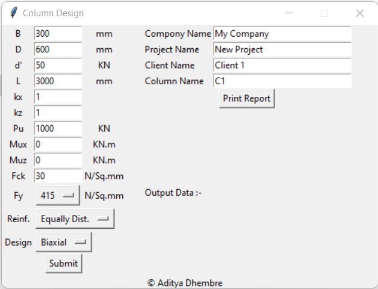
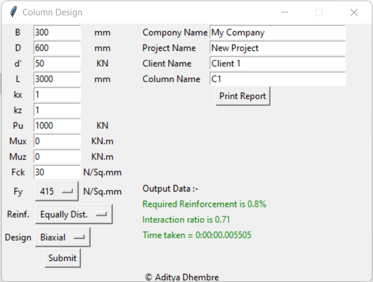
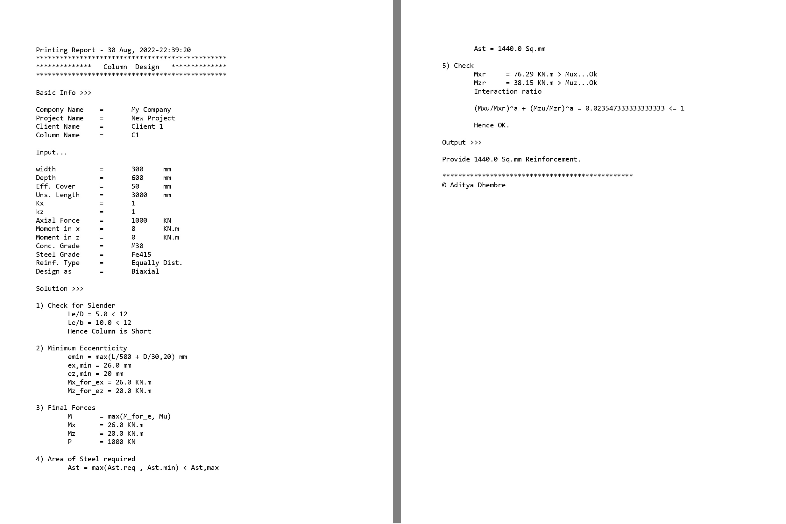

# Column Design

## General
The design of a column member is complicated due to iterative calculations. The Column Design program ease out the efforts in calculations and help the assume prcise sizes at initial stage.

## User Interfase

The above image shows the GUI of the program.

## Output

The output of the design will be shown in **Output Data** section as shown above

## PDF Report

This image shows the detail output generated by the program. This also elaborate some calculation steps.

## Validation
The results obtained by the program are within the limit (for detailed validation problems, refer
[validation.pdf](asset/Validation.pdf) ).

